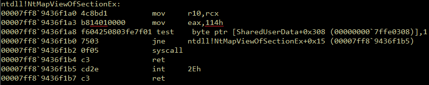

# Get-SyscallID
PowerShell script to get the kernel system call ID for Nt/Zw functions in ntdll.


## Description
The `syscall` instruction, which is typically found in the Nt/Zw functions and differs for each OS version, is how user mode operations switch into kernel mode. Direct syscalls can be made to evade userland hooks placed by EDR without having to remove them first.



## Usage
1. Import the module
```
PS> Import-Module .\Get-SyscallID.ps1
```
2. Run `Get-SyscallID`
- Get the syscall IDs of all Nt/Zw functions.
    ```
    PS> Get-SyscallID
    ```
- Only get the syscall ID for specific Nt/Zw functions
    ```
    PS> Get-SyscallID -Functions NtCreateFile, NtMapViewOfSectionEx
    ```
- Get the syscall IDs from a different copy of `ntdll.dll`
    ```
    PS> Get-SyscallID -Path "C:\Some Other Directory\ntdll.dll"
    ```
<details> <summary>Example output from 2b</summary>

```
Function             SyscallID
--------             ---------
NtCreateFile         0x55
NtMapViewOfSectionEx 0x114
```
</details>